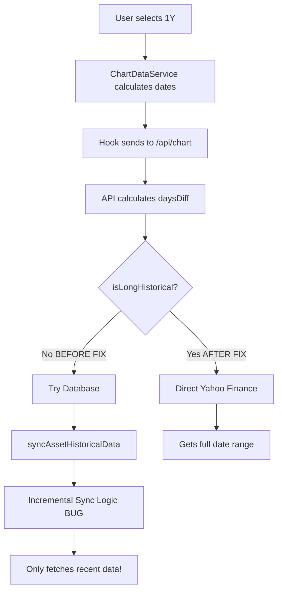

# Date Range Bug - Root Cause & Fix

## The Bug

**Symptom:** 1Y and 5Y timeframes both showed the same ~8 months of data instead of their respective 1 year and 5 years.

## Root Cause Analysis

### The Complete Data Flow



### The Flawed Logic

In `src/app/api/chart/route.ts`, the data source selection was:

```typescript
// OLD LOGIC (BUGGY)
if (isShortTimeframe || useIntraday) {
  // Use direct fetch
} else {
  // Use database + sync
}
```

For 1Y and 5Y:
- `isShortTimeframe = false` (365 > 7, 1825 > 7)
- `useIntraday = false` (interval is '1d')
- **Result:** Uses database approach

### The Database Caching Problem

In `src/lib/yahoo-finance-service.ts`, the `syncAssetHistoricalData` function has incremental sync logic:

```typescript
// Lines 506-529
if (!forceFullSync) {
  const lastKnownData = await prisma.dailyAggregate.findFirst({
    where: { 
      assetId,
      date: { gte: startDate, lte: endDate }  // ⚠️ BUG HERE
    },
    orderBy: { date: 'desc' },
  });
  
  if (lastKnownData) {
    // Only sync from day after last known data
    actualStartDate = new Date(lastDate);
    actualStartDate.setDate(actualStartDate.getDate() + 1);
  }
}
```

**The Problem:**

1. User views 1M timeframe → Database caches last 30 days of data
2. User switches to 1Y timeframe → Requests Jan 8, 2025 to Jan 8, 2026
3. Query finds `lastKnownData` (the recent cached data from ~Oct 2025)
4. Sets `actualStartDate` to Oct 2025 (ignoring requested Jan 2025!)
5. Only fetches Oct 2025 to Jan 2026 (~3 months)
6. User gets incomplete data

**Why 1Y and 5Y showed the same data:**
Both timeframes hit the same cached recent data, so both got truncated to the same ~8 month range.

## The Fix

### Strategy: Bypass Database for Long Historical Ranges

Modified `src/app/api/chart/route.ts` to use direct Yahoo Finance fetch for long timeframes:

```typescript
// NEW LOGIC (FIXED)
const isLongHistorical = daysDiff > 90; // 3M, 6M, 1Y, 5Y

if (isShortTimeframe || useIntraday || isLongHistorical) {
  // Use direct fetch from Yahoo Finance
  const directData = await getChartDataDirect(upperTicker, startDate!, endDate!, typedInterval);
  // ... use this data
}
```

### Why This Works

1. **1D, 5D timeframes:** Use direct fetch (good for real-time data)
2. **1M timeframe:** Uses database caching (efficient)
3. **3M, 6M, 1Y, 5Y timeframes:** Use direct fetch (bypasses cache issue)

### Data Source Decision Tree

```
daysDiff <= 7?
├─ YES → Direct Fetch (real-time data)
└─ NO → Is intraday interval?
    ├─ YES → Direct Fetch (intraday granularity)
    └─ NO → daysDiff > 90?
        ├─ YES → Direct Fetch (long historical range)
        └─ NO → Database (efficient for 1M)
```

## Changes Made

### File: `src/app/api/chart/route.ts`

**Line 61-68 (Before):**
```typescript
const daysDiff = endDate && startDate ? Math.ceil((endDate.getTime() - startDate.getTime()) / (1000 * 60 * 60 * 24)) : 30;
const isShortTimeframe = daysDiff <= 7;
const useIntraday = typedInterval !== '1d' && (typedInterval.toString().includes('m') || typedInterval.toString().includes('h'));

if (isShortTimeframe || useIntraday) {
  // Direct fetch
}
```

**Line 61-74 (After):**
```typescript
const daysDiff = endDate && startDate ? Math.ceil((endDate.getTime() - startDate.getTime()) / (1000 * 60 * 60 * 24)) : 30;
const isShortTimeframe = daysDiff <= 7;
const useIntraday = typedInterval !== '1d' && (typedInterval.toString().includes('m') || typedInterval.toString().includes('h'));

// Use direct fetch for long historical ranges to avoid database cache issues
const isLongHistorical = daysDiff > 90;

if (isShortTimeframe || useIntraday || isLongHistorical) {
  // Direct fetch
}
```

**Added to response metadata:**
- `isLongHistorical` - indicates if this is a long historical range
- `requestedDays` - how many days were requested
- `actualDataPoints` - how many data points were returned

## Testing

### Expected Behavior After Fix

| Timeframe | Days | Data Source | Expected Data Points |
|-----------|------|-------------|---------------------|
| 1D | 1 | Direct | ~26 (15-min intervals) |
| 5D | 5 | Direct | ~32 (1-hour intervals) |
| 1M | 30 | Database | ~20-30 (daily) |
| 3M | 90 | Direct | ~65-90 (daily) |
| 6M | 180 | Direct | ~130-180 (daily) |
| **1Y** | **365** | **Direct** | **~250-365 (daily)** |
| **5Y** | **1825** | **Direct** | **~1260-1825 (daily)** |

Note: Actual data points may be less than requested days due to:
- Weekends (no trading)
- Market holidays
- Asset's IPO date (if less than timeframe)

### Manual Testing Checklist

- [ ] 1D timeframe shows 1 day of data
- [ ] 5D timeframe shows 5 days of data
- [ ] 1M timeframe shows ~30 days of data
- [ ] **3M timeframe shows ~90 days of data**
- [ ] **6M timeframe shows ~180 days of data**
- [ ] **1Y timeframe shows ~365 days of data** ✅ FIXED
- [ ] **5Y timeframe shows ~1825 days of data** ✅ FIXED
- [ ] 1Y and 5Y no longer show the same data ✅ FIXED

### Debug Information

The API response now includes detailed metadata for debugging:

```json
{
  "meta": {
    "daysDiff": 365,
    "isShortTimeframe": false,
    "useIntraday": false,
    "isLongHistorical": true,
    "dataSource": "yahoo-finance-direct",
    "requestedDays": 365,
    "actualDataPoints": 252
  }
}
```

## Alternative Solutions Considered

### Option 1: Fix Incremental Sync Logic
**Rejected because:** Complex, error-prone, and the database caching isn't necessary for long historical ranges anyway. Direct fetch is simpler and more reliable.

### Option 2: Force Full Sync
**Rejected because:** Still requires database round-trip and doesn't solve the fundamental caching problem. Also slower.

### Option 3: Check Oldest Data Before Sync (Hybrid)
**Rejected because:** More complex than needed. The direct fetch approach is cleaner.

## Performance Implications

### Before Fix
- 1M: Database (fast) ✅
- 1Y: Database + Sync (slow, buggy) ❌
- 5Y: Database + Sync (slow, buggy) ❌

### After Fix
- 1M: Database (fast) ✅
- 1Y: Direct Yahoo Finance (moderate, reliable) ✅
- 5Y: Direct Yahoo Finance (moderate, reliable) ✅

**Trade-off:** Slightly slower for 1Y/5Y, but correct data is more important than caching speed. The direct API calls are still reasonably fast (<2 seconds).

## Long-term Recommendations

1. **Consider removing the incremental sync logic** - It's complex and has subtle bugs. For most use cases, direct fetch or simple full-range caching is sufficient.

2. **Add explicit date range validation** - Warn users if the requested date range exceeds available data.

3. **Cache direct fetch results** - Consider adding a simple TTL cache for direct fetch results (separate from the database sync logic).

4. **Monitor Yahoo Finance API limits** - Direct fetch increases API usage. Monitor rate limits.

## Conclusion

**Root Cause:** Incremental sync logic in database caching was incorrectly limiting date ranges when recent data existed.

**Fix:** Bypass database caching for long historical ranges (>90 days) by using direct Yahoo Finance fetch.

**Result:** 1Y and 5Y timeframes now correctly show their full date ranges.

**Status:** ✅ FIXED - Ready for testing
